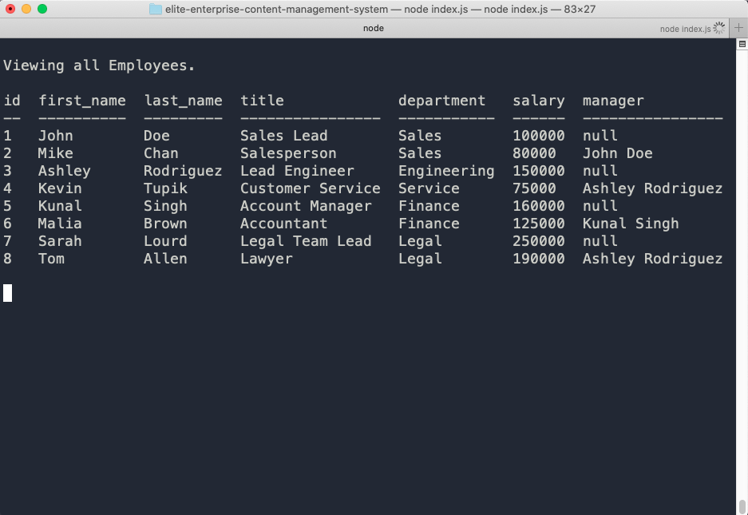

# elite-enterprise-content-management-system

## Description

This is an enterprise content management system. It allows the easy viewing ,, modification, and deletion of a company's employees, roles, and managerers.

## Table of Contents

- [Installation](#installation)
- [Usage](#usage)
- [Screenshot](#screenshot)
- [License](#license)
- [Contributing](#contributing)
- [Tests](#tests)
- [Questions](#questions)

## Installation

To utilize this project, first downdload the code. Then npm install in the projects main directory. Once all packages are installed, open a mysql console and run source schema.sql and source seeds.sql. Once all the data was seeded, you will need to run node index.js or node .

## Usage

node index.js

## Screenshot

## License

This project is covered under the following: MIT License

## Contributing

To contribute, write a GitHub issue

## Tests

N/A

## Questions

Direct all questions to: rafael.barbosa51@gmail.com

Github User Name: rbarbosa51

Github Profile URL: https://github.com/rbarbosa51